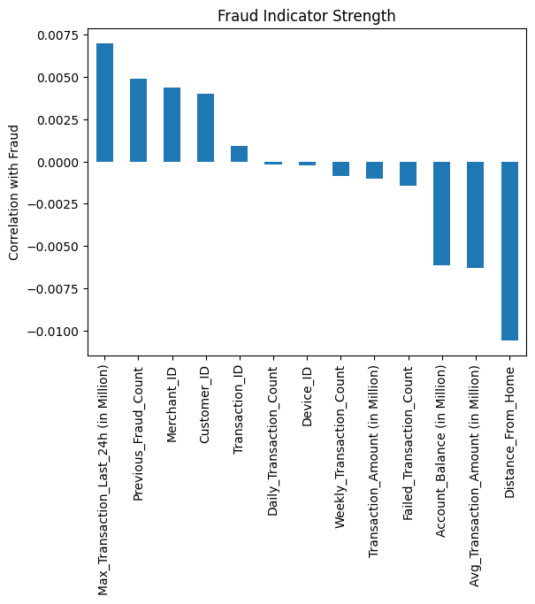
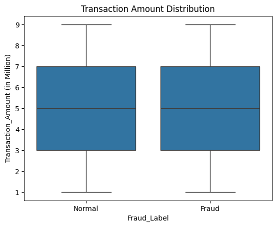
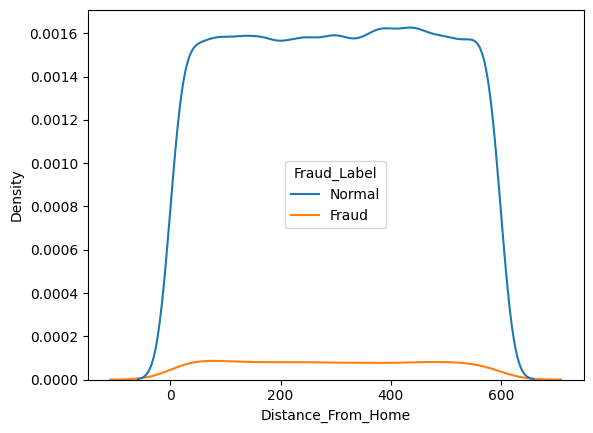
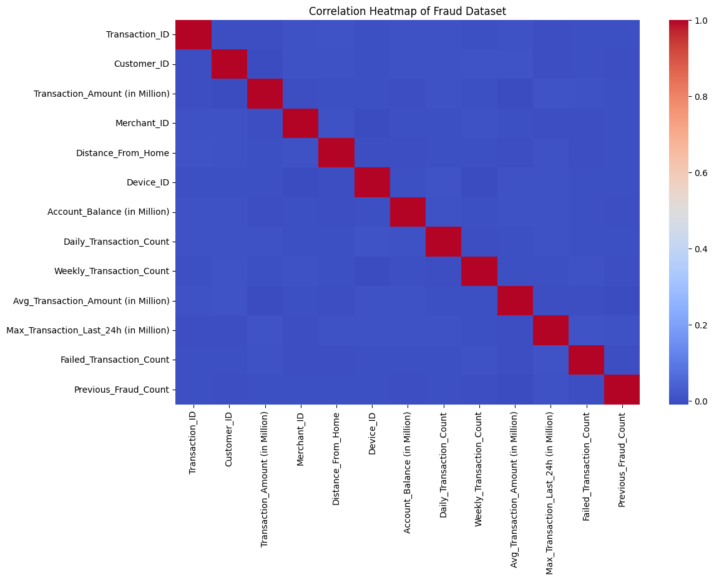

# Fraud Detection Exploratory Data Analysis

## Project Overview

This project explores a banking transaction dataset to identify behavioural patterns associated with fraudulent transactions. The analysis focuses on understanding which transaction characteristics are most strongly related to fraud occurrence through structured exploratory data analysis (EDA).

The goal of the project is to demonstrate a practical workflow for:

- Data cleaning
- Exploratory data analysis
- Feature investigation
- Fraud risk identification
- Analytical interpretation

The project was completed using Python and Jupyter Notebook.

## Example Analysis

### Fraud Distribution

### Transaction Amount Distribution

### Distance From Home Distribution

### Correlation Heatmap

---

## Key Findings

### Fraud prevalence

Fraudulent transactions represent approximately **4–5% of the dataset**, indicating a moderately imbalanced dataset.

---

### Transaction amount

Transaction amount distributions for fraudulent and legitimate transactions are nearly identical. Both the statistical summaries and distribution visualisations show similar medians and ranges.

This suggests that **transaction value alone is not a strong indicator of fraud** in this dataset.

---

### Distance from home

Distance from the customer’s home location shows **very similar distributions between fraudulent and legitimate transactions**. Median values differ only slightly and the density curves overlap substantially.

This indicates that **transaction distance does not meaningfully distinguish fraudulent behaviour in this dataset**.

---

### International transactions

International transactions demonstrate **higher fraud rates compared to domestic transactions**.

Approximate fraud rates observed:

- Domestic transactions: **~3–4%**
- International transactions: **~6%**

This suggests that **international transaction context represents elevated fraud risk**.

---

### Merchant novelty

Transactions involving **new merchants do not significantly increase fraud risk independently**. Fraud rates remain relatively similar between transactions involving new merchants and those with existing merchants.

---

### Combined behavioural signals

The highest fraud rate occurs when transactions are **both international and involve new merchants**, although the increase appears primarily driven by the international transaction factor.

---

### Overall conclusion

The analysis suggests that fraud in this dataset is more strongly associated with **transaction context and behavioural indicators** rather than transaction magnitude or location distance.

Variables such as **international transaction status** appear to provide more meaningful signals than transaction size or distance from the customer's home.

---

## Dataset

This dataset is a synthetic banking transaction dataset commonly used for fraud detection analysis and machine learning practice.The dataset contains **50,000 banking transactions** with variables describing transaction characteristics, customer behaviour, and fraud indicators.

Example features include:

- Transaction amount
- Distance from customer home location
- International transaction flag
- Merchant novelty indicator
- Failed transaction attempts
- Previous fraud history
- Daily and weekly transaction behaviour

The target variable is:

`Fraud_Label`

which identifies whether a transaction is **Fraud** or **Normal**.

---

## Methodology

The analysis follows a structured exploratory data analysis workflow:

1. Data Overview  
2. Data Quality Assessment  
3. Data Cleaning  
4. Exploratory Data Analysis  
5. Behavioural Pattern Investigation  
6. Multivariate Feature Analysis  
7. Summary of Key Findings  

The objective is to identify behavioural indicators that may be associated with fraudulent transactions.

---

## Tools & Libraries

The analysis was conducted using Python and the following libraries:

- Pandas
- NumPy
- Matplotlib
- Seaborn
- Jupyter Notebook

---

## Project Skills Demonstrated

This project demonstrates practical analytical skills including:

- Data cleaning and preparation
- Exploratory data analysis (EDA)
- Hypothesis-driven feature investigation
- Fraud risk segmentation
- Data visualisation
- Analytical interpretation and reporting

---

## Repository Structure

Fraud-Detection
│
├── fraud_analysis.ipynb        # Jupyter notebook containing the analysis
├── FraudShield_Banking_Data.csv # Dataset
├── fraud_bar.png               # Fraud distribution chart
├── fraud_box.png               # Transaction amount boxplot
├── fraud_kde.png               # Distance from home density plot
├── fraud_heatmap.png           # Feature correlation heatmap
└── README.md

---

## Future Improvements

Potential extensions of this project include:

- Building a fraud prediction model
- Applying classification algorithms (Logistic Regression, Random Forest)
- Feature importance analysis
- Model evaluation using precision, recall, and ROC-AUC
- Fraud detection dashboard visualisation

---

## Author

Joshua Garthwaite

Aspiring Commercial / Data Analyst with a focus on applying analytical methods to real-world business problems.
